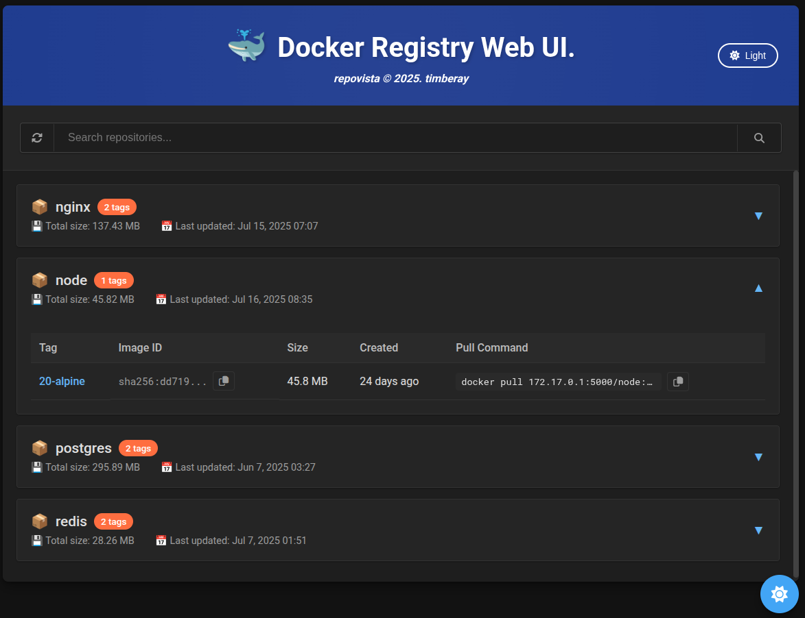

# RepoVista - Docker Registry Web UI

RepoVista is a modern and intuitive web interface for Docker Registry, providing developers with an easy way to browse and select Docker images for deployment.


## 🖼️ Screenshots

### Dark Mode


*RepoVista with Dark Mode - Modern Docker Registry Management Interface*

## 🚀 Key Features

### 📦 Repository Management
- View all repositories from Docker Registry
- Display repository details (tag count, last updated)
- Real-time search and filtering
- Sorting options (name, tag count, update date)

### 🏷️ Tag Management
- List all tags for each repository
- View tag details (size, digest, created date)
- Copy-to-clipboard pull commands
- Formatted dates and sizes for better readability

### 🔍 Search & Filter
- Real-time repository search
- Sort by name or date (ascending/descending)
- Pagination controls (20/50/100 items per page)

### 📱 User Interface
- **🌙 Dark Mode Support** - Toggle between light and dark themes
- Clean, modern design with both light and dark themes
- Grid layout for repository cards
- Accordion-style tag expansion
- Loading states and error messages
- Desktop-optimized (Chrome browser support)
- Smooth theme transitions with CSS animations
- Theme persistence using localStorage

## 🏗️ Architecture

```
┌─────────────────┐    ┌─────────────────┐    ┌─────────────────┐
│   Frontend      │    │   Backend       │    │   Docker        │
│   (Pure JS)     │◄──►│   (FastAPI)     │◄──►│   Registry      │
│                 │    │                 │    │                 │
│ - Repository    │    │ - REST API      │    │ - Image Store   │
│   List          │    │ - Registry      │    │ - Tag Manager   │
│ - Tag Display   │    │   Client        │    │ - Metadata      │
│ - Search UI     │    │ - CORS Config   │    │                 │
└─────────────────┘    └─────────────────┘    └─────────────────┘
```

## 🛠️ Technology Stack

### Frontend
- **Pure JavaScript** (ES6+) - No frameworks
- **HTML5 & CSS3** - Modern web standards
- **Fetch API** - HTTP communication
- **Modular Architecture** - Clean separation of concerns

### Backend
- **FastAPI** - High-performance Python web framework
- **Pydantic** - Data validation
- **httpx** - Async HTTP client
- **Python 3.8+** - Modern Python features

### Infrastructure
- **Docker** - Containerization
- **Nginx** - Static file serving
- **Docker Compose** - Multi-container orchestration

## 📦 Installation & Setup

### 1. Clone Repository
```bash
git clone https://github.com/timberay/repovista.git
cd repovista
```

### 2. Environment Configuration
```bash
cp .env.example .env
# Edit .env file with your Docker Registry settings
```

### 3. Run with Docker Compose

**Default ports:**
```bash
docker-compose up -d
```

**Custom ports (8082 for frontend, 3032 for backend):**
```bash
# The docker-compose.override.yml file automatically applies custom ports
docker-compose up -d
```

### 4. Access the Application
- Frontend UI: http://localhost:8082
- Backend API: http://localhost:3032
- API Documentation: http://localhost:3032/api/docs

## ⚙️ Configuration

### Environment Variables

| Variable | Description | Default |
|----------|-------------|---------|
| `REGISTRY_URL` | Docker Registry URL | `http://localhost:5000` |
| `REGISTRY_USERNAME` | Registry username (if auth required) | - |
| `REGISTRY_PASSWORD` | Registry password (if auth required) | - |
| `API_PORT` | Backend API internal port (container) | `8000` |
| `FRONTEND_PORT` | Frontend internal port (container) | `80` |
| `CORS_ORIGINS` | Allowed CORS origins | `http://localhost` |

**Note:** Port mapping is configured in `docker-compose.yml`:
- Backend: Host port `3032` → Container port `8000` (with override file)
- Frontend: Host port `8082` → Container port `80` (with override file)

### Connecting to Docker Registry

RepoVista connects to your existing Docker Registry. Configure the connection in your `.env` file:

#### Registry Configuration
```bash
# Point to your existing Docker Registry
REGISTRY_URL=https://your-registry.example.com

# Add credentials if authentication is required
REGISTRY_USERNAME=your-username
REGISTRY_PASSWORD=your-password
```

**Note**: RepoVista is a read-only UI client for Docker Registry. It does not manage or run the Registry itself.

## 🔧 Development

### Local Development Environment

#### Backend Development
```bash
cd backend
python -m venv venv
source venv/bin/activate  # Windows: venv\Scripts\activate
pip install -r requirements.txt
uvicorn main:app --reload --host 0.0.0.0 --port 3032
```

#### Frontend Development
```bash
cd frontend
# Serve static files (using Python's built-in server)
python -m http.server 8082
```

**Note**: Using non-standard ports (3032, 8082) to avoid conflicts with common development services.

### Running Tests
```bash
# Integration tests
node test-integration.js

# Backend tests
cd backend
pytest tests/

# Frontend tests
# Open test-console.html in browser for manual testing
```

### Building Deployment Package
```bash
# Build with default version (v1.0.0)
./build-deploy-package.sh

# Build with specific version
./build-deploy-package.sh v2.0.0

# Force rebuild (ignore cached images)
./build-deploy-package.sh v2.0.0 --force

# Show help
./build-deploy-package.sh --help
```

### Docker Management
```bash
# Build images (with cache)
./docker-deploy.sh build

# Force rebuild without cache
./docker-deploy.sh build --no-cache

# Start services
./docker-deploy.sh start

# Check health (ports 3032/8082)
./docker-deploy.sh health
```

## 📚 API Documentation

### Main Endpoints

#### Repository Operations
- `GET /api/repositories` - List all repositories
- `GET /api/repositories/{name}/tags` - List tags for a repository

#### Search & Filtering
- `GET /api/repositories?search={query}` - Search repositories
- `GET /api/repositories?sort_by={field}&sort_order={asc|desc}` - Sort results
- `GET /api/repositories?page={n}&page_size={20|50|100}` - Pagination

### Response Format

#### Repository List
```json
{
  "repositories": [
    {
      "name": "nginx",
      "tag_count": 15,
      "last_updated": "2023-12-01T12:00:00Z",
      "last_updated_formatted": "2 days ago"
    }
  ],
  "pagination": {
    "page": 1,
    "page_size": 20,
    "total_pages": 1,
    "total_items": 1,
    "has_next": false,
    "has_previous": false
  }
}
```

#### Tag List
```json
{
  "tags": [
    {
      "repository": "nginx",
      "tag": "latest",
      "digest": "sha256:...",
      "size_bytes": 142857600,
      "size_formatted": "136.2 MB",
      "created": "2023-12-01T12:00:00Z",
      "created_formatted": "2 days ago",
      "pull_command": "docker pull localhost:5000/nginx:latest"
    }
  ],
  "page": 1,
  "page_size": 20,
  "total_count": 1,
  "total_pages": 1
}
```

## 🎨 UI Components & Features

### Main Components
- **Repository Cards** - Grid layout for repository display
- **Tag Accordion** - Expandable tag details
- **Search Bar** - Real-time search input
- **Pagination Controls** - Page size and navigation
- **Loading Spinner** - Visual feedback during data fetch
- **Error Messages** - User-friendly error display
- **Theme Toggle** - Switch between light and dark modes

### Dark Mode Features
- **🌙 Floating Theme Toggle** - Fixed button at bottom-right corner
- **☀️ Header Theme Toggle** - Inline button in the header with text label
- **💾 Theme Persistence** - Saves preference to localStorage
- **🖥️ System Preference Detection** - Automatically detects OS dark mode
- **🎨 Optimized Color Palette** - Carefully selected colors for both themes
- **✨ Smooth Transitions** - Animated theme switching

### Styling
- Clean, modern design with both light and dark themes
- CSS Grid for responsive layout
- CSS variables for consistent theming
- Smooth transitions and animations
- High contrast ratios for accessibility

## 🔍 Usage

### 1. Browse Repositories
1. View all repositories on the main page
2. Use the search bar to filter repositories
3. Sort by name or date using sort controls

### 2. View Tags
1. Click on a repository card to expand tag details
2. View tag information including size and creation date
3. Copy pull commands with one click

### 3. Search and Filter
1. Type in the search bar for real-time filtering
2. Use pagination controls to navigate results
3. Sort results by name or date

### 4. Toggle Dark Mode
1. Click the moon/sun icon in the header or floating button
2. Theme preference is automatically saved
3. Respects system dark mode preference on first visit

## 🚀 Performance Optimization

### Frontend Optimization
- Debounced search input (300ms delay)
- Efficient DOM updates
- Minimized re-renders
- Optimized event delegation
- CSS variables for instant theme switching
- Lazy loading for performance

### Backend Optimization
- Async/await for non-blocking operations
- Connection pooling for Registry API
- Error handling and retry logic
- CORS configuration for security

## 🐛 Troubleshooting

### Common Issues

#### 1. Registry Connection Failed
```bash
# Check Registry status
curl http://localhost:5000/v2/

# Verify credentials if authentication is required
docker login localhost:5000
```

#### 2. CORS Errors
```bash
# Check CORS_ORIGINS in .env file
CORS_ORIGINS=http://localhost,http://localhost:3000
```

#### 3. Port Conflicts
```bash
# Check ports in use
netstat -tulpn | grep :80
netstat -tulpn | grep :8000

# Change ports in .env
API_PORT=8001
FRONTEND_PORT=8080
```

### View Logs
```bash
# Backend logs
docker-compose logs backend

# Frontend logs
docker-compose logs frontend

# Follow logs in real-time
docker-compose logs -f
```

## 🤝 Contributing

1. Fork the repository
2. Create a feature branch (`git checkout -b feature/amazing-feature`)
3. Commit your changes (`git commit -m 'Add amazing feature'`)
4. Push to the branch (`git push origin feature/amazing-feature`)
5. Open a Pull Request

## 📄 License

This project is licensed under the MIT License - see the [LICENSE](LICENSE) file for details.

## 🙏 Acknowledgments

- [Docker Registry](https://docs.docker.com/registry/) - Image storage backend
- [FastAPI](https://fastapi.tiangolo.com/) - Backend framework
- [Nginx](https://nginx.org/) - Web server

## 📞 Support

For issues or questions, please open an issue on [GitHub Issues](https://github.com/your-username/repovista/issues).

---

**RepoVista** - Making Docker Registry management simple and intuitive! 🐳